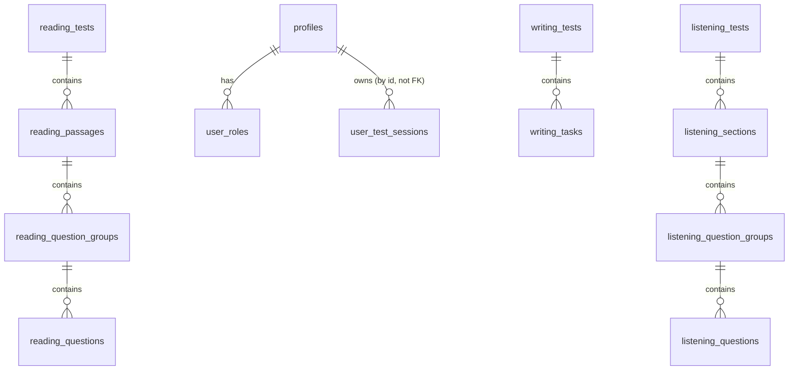

# Database Schema & Data Model

All data lives in a single SQLite database file (`ielts.db`), created and migrated automatically on app startup by `src/core/src/database/mod.rs`. The full schema is defined in one migration: `src/core/src/database/migrations/20260811000000_initial_schema.sql`.

## Entities

### `profiles`
| Field | Type | Notes |
|---|---|---|
| `id` | TEXT PK | Matches the anonymous `user_id` (`getAnonId()`) or an admin-created profile id |
| `full_name` | TEXT | Optional |
| `avatar_url` | TEXT | Optional |
| `plan_type` | TEXT | `'free'` \| `'premium'`, default `'free'` |
| `email` | TEXT | Optional, indexed |
| `is_banned` | INTEGER (bool) | Default `0` |
| `ban_reason` | TEXT | Optional |
| `banned_until` | TEXT | Optional ISO timestamp |
| `updated_at` | TEXT | ISO timestamp, auto-set |

### `user_roles`
| Field | Type | Notes |
|---|---|---|
| `id` | TEXT PK | |
| `user_id` | TEXT | FK → `profiles.id`, `ON DELETE CASCADE` |
| `role` | TEXT | `'student'` \| `'super_admin'` |
| `created_at` | TEXT | |

Unique constraint on `(user_id, role)`. **A `profiles` row must exist before inserting a `user_roles` row** for that user — the foreign key will fail otherwise. Test fixtures must seed `profiles` first (see [Testing Strategy](../testing/testing-strategy.mdx)).

### `user_test_sessions`
| Field | Type | Notes |
|---|---|---|
| `id` | TEXT PK | |
| `user_id` | TEXT | Not an FK — matches the anon id string |
| `test_id` | TEXT | Not an FK — id of a reading/writing/listening test |
| `test_type` | TEXT | `'reading'` \| `'writing'` \| `'listening'` |
| `status` | TEXT | `'in_progress'` \| `'completed'` |
| `progress_percent` | INTEGER | 0–100 |
| `score_band` | REAL | Nullable band score |
| `attempt_number` | INTEGER | Default 1, supports retake history |
| `answers` | TEXT | JSON string, nullable |
| `feedback_data` | TEXT | JSON string, nullable |
| `started_at` / `completed_at` / `last_active_at` / `created_at` | TEXT | ISO timestamps |

Indexed on `user_id` and on `(user_id, test_id, test_type, attempt_number)` for lookup/aggregation.

### Reading: `reading_tests` → `reading_passages` → `reading_question_groups` → `reading_questions`
- `reading_tests`: `id`, `created_by`, `title`, `test_type` (default `Academic`), `difficulty`, `duration`, `status` (`draft`/`published`), timestamps.
- `reading_passages`: FK `test_id → reading_tests.id` (cascade delete), `passage_number`, `title`, `content`, `notes`.
- `reading_question_groups`: FK `passage_id → reading_passages.id` (cascade delete), `group_order`, `question_type`, `instructions`, `word_limit`, `has_word_bank`, `word_bank` (JSON), `sequential_order`, `multiple_selection`, `select_count`.
- `reading_questions`: FK `group_id → reading_question_groups.id` (cascade delete), `question_order`, `text`, `answer`, `options`/`matching_pairs`/`completion_gaps`/`accepted_answers` (all JSON strings).

### Writing: `writing_tests` → `writing_tasks`
- `writing_tests`: `id`, `created_by`, `title`, `status`, timestamps.
- `writing_tasks`: FK `test_id → writing_tests.id` (cascade delete), `task_number`, `task_type` (`task1`/`task2`), `title`, `difficulty`, `suggested_time`, `prompt`, `min_words`, `max_words`, `image_url`, `include_model_answer`, `model_answer`.

### Listening: `listening_tests` → `listening_sections` → `listening_question_groups` → `listening_questions`
- `listening_tests`: `id`, `created_by`, `title`, `difficulty`, `duration`, `status`, timestamps.
- `listening_sections`: FK `test_id → listening_tests.id` (cascade delete), `section_number`, `title`, `transcript`, `audio_url`.
- `listening_question_groups`: same shape as reading question groups, FK `section_id → listening_sections.id`.
- `listening_questions`: same shape as reading questions plus a `timestamp` field (audio cue point), FK `group_id → listening_question_groups.id`.

## Entity relationship diagram

Note: `user_test_sessions.user_id`/`test_id` are plain TEXT columns, **not** declared foreign keys in the schema — ownership is enforced in application/repository code rather than by SQLite constraints.

## Migrations & compile-time query checking

Migrations live in `src/core/src/database/migrations/` and run automatically via `sqlx::migrate!(...)` in `database::init()` at app startup — there is currently a single migration file (`20260811000000_initial_schema.sql`). `sqlx`'s macros (`query!`, `query_as!`, `query_scalar!`) type-check SQL against the live schema at compile time, which is why the schema and Rust code must stay in sync; the `DATABASE_URL` env var must point at a real `ielts.db` (see [`CONTRIBUTING.md`](https://github.com/open-lingua/ielts-mastery-hub/blob/main/CONTRIBUTING.md)) for `cargo build`/`cargo check` to succeed.

## Why Practice Library merges results in Rust, not SQL `UNION`

`reading_tests`, `writing_tests`, and `listening_tests` have different column shapes. `sqlx::query_as!`/`query!` require a single, statically known result shape per query, so a SQL `UNION` across heterogeneous tables isn't compatible with compile-time checking. Instead, `src/core/src/repositories/practice_library.rs` runs one paginated query per module (each mapped to a common `PracticeTestRow`), then merge-sorts the three result sets by `created_at DESC` in Rust before paginating in-memory. See [Practice Test Library](../features/practice-library.mdx) for the full behavior.
