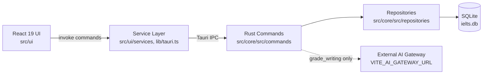

# System Architecture Overview

IELTS Mastery Hub is a **local-first desktop application**. There is no application server: the React UI calls Rust commands through Tauri's IPC bridge, and Rust reads/writes a local SQLite database. The only outbound network request the app makes is to an external AI grading gateway when scoring Writing submissions.

## Technology choices

| Layer | Technology | Why |
|---|---|---|
| UI framework | React 19 | Modern concurrent rendering, component model |
| Language | TypeScript (strict mode) | Type safety across the IPC boundary |
| Build tool | Vite + SWC (`@vitejs/plugin-react-swc`) | Fast dev server and HMR |
| Routing | React Router v6 (`react-router-dom` v7 package) | Client-side route-level pages |
| Styling | Tailwind CSS v4 | Utility-first styling |
| Components | shadcn/ui (Radix primitives) | Accessible design-system primitives |
| Animation | Framer Motion | Transitions/animations |
| Charts | Recharts | Progress/score visualizations |
| Async/server state | TanStack React Query | Caching Tauri command results |
| Forms | React Hook Form + Zod (`@hookform/resolvers`) | Form state + schema validation |
| Desktop runtime | Tauri 2 | Rust-backed native shell, small binaries |
| Backend language | Rust | Safety + performance for local data access |
| Database driver | `sqlx` (SQLite) | Compile-time checked queries, async |
| Async runtime | `tokio` | Async Rust runtime used by `sqlx`/Tauri |

## Local-first, not client-server

There is no REST/GraphQL API and no remote database. All Reading, Writing, Listening, and session data lives in a single SQLite file (`ielts.db`) in the OS-specific app data directory (see [Local Data Storage & Privacy](../desktop/data-storage-and-privacy.mdx)). The one exception is the Writing module's AI grading feature, which sends the prompt and student response to an external gateway URL configured via `VITE_AI_GATEWAY_URL` (see [Writing Module & AI Grading](../features/writing-module-and-ai-grading.mdx)).

## Where to go next

- [Frontend Architecture](./frontend-architecture.mdx) — directory structure, routing, state management
- [Backend Architecture](./backend-architecture.mdx) — command/repository layering, error handling
- [Database Schema](./database-schema.mdx) — full entity/relationship reference
- [IPC Contract](./ipc-contract.mdx) — naming conventions across the Tauri boundary
