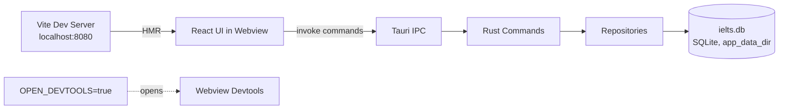

# Running the App in Development

Start the full desktop app (Rust backend + Vite dev server) with:

```bash
npm run tauri
```

This runs the `tauri dev` command configured in `package.json`, which uses `src/core/tauri.conf.json`. Under the hood, Tauri starts the Vite dev server (`beforeDevCommand`) and points the desktop shell's webview at `devUrl` (`http://localhost:8080`), then compiles and launches the Rust binary.

## Hot reload behavior

- **Frontend (`src/ui/`)** — Vite + SWC provide fast HMR. Most component/style edits update instantly in the running webview without a full reload.
- **Backend (`src/core/`)** — Rust changes require Tauri to recompile the binary. The dev process detects source changes and rebuilds/restarts automatically; expect a short pause (typically several seconds) for Rust recompilation, longer than frontend HMR.

## Opening the webview devtools

Set the `OPEN_DEVTOOLS` environment variable to automatically open devtools on startup:

```bash
OPEN_DEVTOOLS=true npm run tauri
```

This is read in the Rust `setup` hook (`src/core/src/lib.rs`):

```rust
if std::env::var("OPEN_DEVTOOLS").as_deref() == Ok("true") {
    if let Some(window) = app.get_webview_window("main") {
        window.open_devtools();
    }
}
```

## Local SQLite database

On startup, the Rust backend (`src/core/src/database/mod.rs`) resolves the platform's app data directory and opens/creates `ielts.db` there, then runs migrations (`src/core/src/database/migrations/`) and seeds (`src/core/src/database/seeds/`) automatically:

| OS | Typical location |
|---|---|
| macOS | `~/Library/Application Support/com.openlingua.ieltsmasteryhub/ielts.db` |
| Linux | `~/.local/share/com.openlingua.ieltsmasteryhub/ielts.db` |
| Windows | `%APPDATA%\com.openlingua.ieltsmasteryhub\ielts.db` |

### Resetting the database during development

To start fresh, quit the app and delete the `ielts.db` file (plus any `-wal`/`-shm` companion files) at the path above. On the next `npm run tauri` launch, migrations and seeds will recreate it. See [`docs/database-reset.md`](https://github.com/open-lingua/ielts-mastery-hub/blob/main/docs/database-reset.md) for repo-specific reset notes and [`CONTRIBUTING.md`](https://github.com/open-lingua/ielts-mastery-hub/blob/main/CONTRIBUTING.md) for how to point `sqlx` CLI tooling at this same file via `DATABASE_URL`.

## Dev architecture at a glance



Next: [Building for Production](./building-for-production.mdx).
