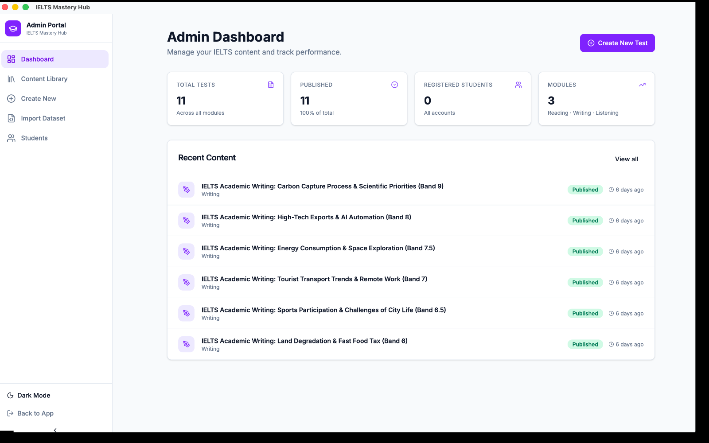

# Getting Started with the Admin Portal

The Admin Portal is where instructors and content managers create tests, publish them, import ready-made test files, export backups, and review student profiles.

## What you can do here

From the Admin area, you can:

- create new Reading, Writing, and Listening tests
- save work as a draft or publish it
- browse your Content Library
- import tests from JSON files
- export tests as ZIP backups
- review and update student profiles

## Admin sidebar at a glance

The sidebar is arranged in this order:

| Section | What it is for |
|---|---|
| Dashboard | A quick summary of your content and recent activity |
| Content Library | Your full list of saved tests |
| Create New | The Test Creator Studio |
| Import Dataset | The import wizard for JSON test files |
| Students | Registered profile management |

## What you will see on the Dashboard

The Dashboard gives you a quick snapshot of the app, including:

- total tests
- how many are published
- registered students
- module counts
- a recent content list

It is a good starting point when you want to check what already exists before creating or importing more content.

## Moving between sections

1. Open the app.
2. Go to **Admin Portal**.
3. Use the left sidebar to switch between **Dashboard**, **Content Library**, **Create New**, **Import Dataset**, and **Students**.

You can move freely between these sections at any time.

:::warning No separate admin login yet
There is currently no separate login for admins vs. students. Anyone using this install of the app can open the Admin Portal. This works well for single-user or small trusted-team use today.
:::

:::tip Good everyday workflow
Many admins start on **Dashboard**, check **Content Library**, then open **Create New** or **Import Dataset** depending on whether they are building content from scratch or bringing content in from a file.
:::
