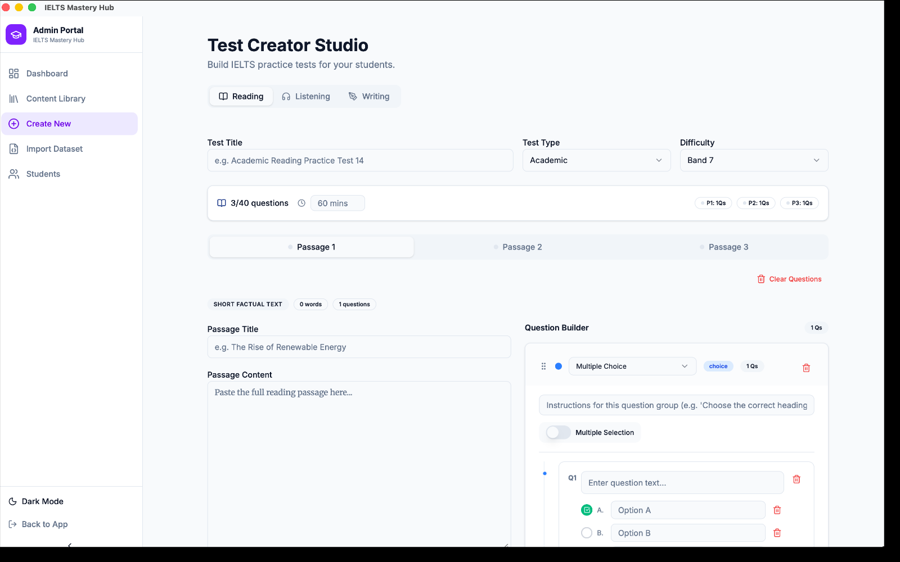
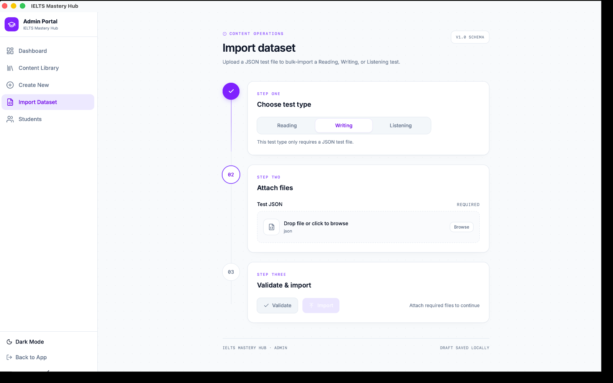

# Creating a New Reading, Writing, or Listening Test

Use **Create New** in the Admin sidebar to open the Test Creator Studio.

The studio has three main tabs:

- **Reading**
- **Listening**
- **Writing**

No matter which tab you choose, you will start by filling in the main test details.

## Step 1: Enter the basic test details

At the top of the screen, add the test's core information:

- **Title**
- **Difficulty band**
- **Duration**

These details help you recognise the test later in the Content Library and help students understand what to expect.

## Step 2: Build a Reading test

Reading tests are built from:

- one test
- one or more passages
- question groups inside each passage
- individual questions inside each group

For each passage, you can add:

- a passage title
- the full passage text
- one or more question groups

Inside each question group, you can build the questions students will answer.

## Step 3: Build a Writing test

Writing tests use two tasks:

- **Task 1**
- **Task 2**

For Writing, you can set:

- the prompt text for each task
- **minimum word count**
- **maximum word count**
- **suggested time**

For **Task 1**, you can also upload an optional chart or graph image for students to refer to while writing.

## Step 4: Build a Listening test

Listening tests can include up to **4 sections**.

Each section can have:

- a section title
- an audio upload
- a transcript
- time-synced question groups and questions

This lets you prepare the full listening flow section by section.

## Step 5: Preview the student view

Before you save or publish, click **Preview**.

This shows you the test in a student-style view so you can quickly check:

- layout
- wording
- passage or section order
- prompts and question setup

Preview is especially useful for catching missing text, awkward instructions, or the wrong task details before students see the test.

## Step 6: Save as Draft or Publish

When you are ready, choose one of these options:

| Option | What happens |
|---|---|
| Save as Draft | Keeps the test as work in progress |
| Publish | Makes the test available in the Practice Library |

:::note What Draft and Published mean
A **Draft** stays tied to the app identity that created it, so other people using the install will not see it in the Practice Library. A **Published** test appears in the Practice Library for everyone using this install.
:::

## A simple creation flow

1. Click **Create New**.
2. Choose **Reading**, **Writing**, or **Listening**.
3. Enter the title, band, and duration.
4. Add passages, tasks, or sections.
5. Click **Preview**.
6. Save as **Draft** or **Publish**.

:::tip Start with a draft
If you are building a longer test, it is usually best to save a draft first, review it, then publish when you are happy with the final version.
:::
