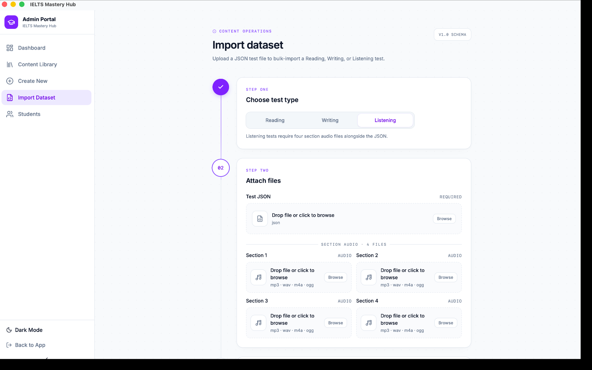

# Importing Tests from a JSON File

Use **Import Dataset** when you already have a test prepared as a file and want to bring it into the app.

The import screen is a simple 3-step wizard.

## Step 1: Choose test type

Start by choosing the kind of test you are importing:

- **Reading**
- **Writing**
- **Listening**

This matters because the app checks the file differently for each test type.

## Step 2: Attach the required files

Every import needs a **JSON** test file.

In plain language, that JSON should include the full test content in the right shape for the test type you picked. For example:

- a Reading import should include the test details, passages, question groups, and questions
- a Writing import should include the test details and writing tasks
- a Listening import should include the test details, sections, question groups, and questions

### Extra requirement for Listening

Listening imports also need **exactly 4 audio files** — one for each section.

Use one audio file per section, and make sure every section has a file attached before you validate the import.

:::tip Audio format choice
For Listening imports, **MP3** and **WAV** are confirmed supported formats and are the safest choices to use.
:::

## Step 3: Validate and review

Click **Validate** before you import.

The validation step shows a summary preview, including:

- the test title
- whether the file is Reading, Writing, or Listening
- how many passages, sections, or tasks were found
- question group count where relevant
- question count where relevant
- a warning if a test with the same title already exists

This gives you a chance to catch mistakes before anything is added to the library.

## Finish the import

If the preview looks correct, click **Import**.

After a successful import, the test is added to your **Content Library** as a **Draft**.

That means you can open it, review it, and publish it later when ready.

## Common import problems

| Problem | What to check first |
|---|---|
| The file will not validate | Make sure it is valid JSON |
| The file type seems wrong | Make sure the JSON structure matches the test type you chose |
| Listening import fails | Make sure all 4 section audio files are attached |
| A section is still missing | Make sure each Listening section has its own file |

:::warning A common Listening mistake
If you choose **Listening**, the import will fail if even one of the four section audio files is missing.
:::

## Recommended import flow

1. Open **Import Dataset**.
2. Choose **Reading**, **Writing**, or **Listening**.
3. Attach the JSON file.
4. If it is a Listening test, attach all 4 section audio files.
5. Click **Validate**.
6. Review the preview summary.
7. Click **Import**.
