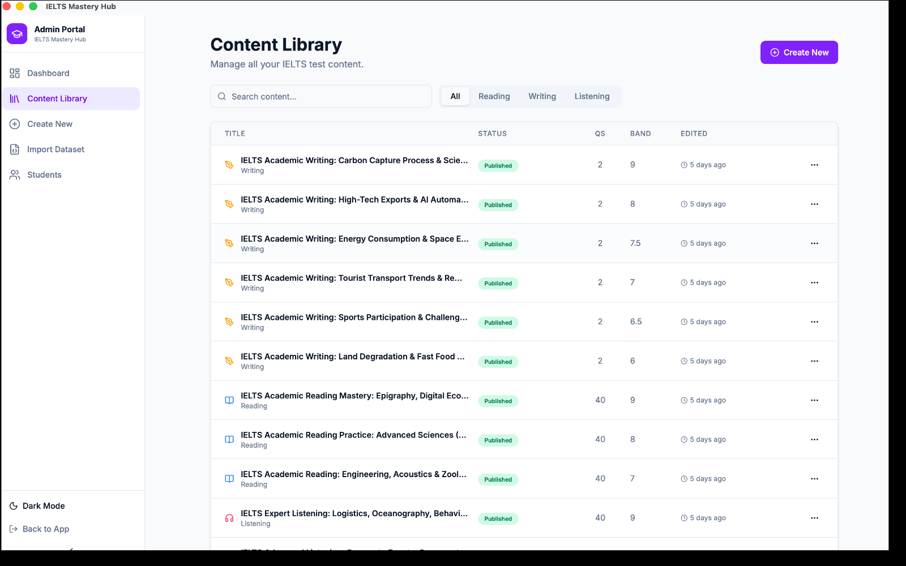

# Managing Your Test Content Library

The **Content Library** is your main place for finding, reviewing, and managing tests you have already created or imported.

## What you can do on this page

You can use the Content Library to:

- search for a test by title
- switch between **All**, **Reading**, **Writing**, and **Listening**
- check whether a test is a **Draft** or **Published** item
- reopen a test for editing
- export a test as a ZIP file
- permanently delete a test

## Understanding the table

Each row shows key details about one test.

| Column | What it shows |
|---|---|
| Title | The test name and module |
| Status | Whether the test is Draft or Published |
| Qs | The question count |
| Band | The difficulty band |
| Edited | When it was last updated |

## Finding the right test

Use the search box to narrow the list by title.

Use the module tabs to switch between:

- **All**
- **Reading**
- **Writing**
- **Listening**

:::note About status
The current library clearly shows **Draft** and **Published** in the Status column, so you can quickly tell what is live and what is still in progress.
:::

## Using the 3-dot menu

At the end of each row, click the **3-dot menu**.

The actions appear in this order:

1. **Edit**
2. **Export**
3. **Delete**

### Edit

**Edit** opens the Test Creator Studio again with that test already filled in.

Use this when you want to:

- correct a typo
- update questions
- change timings
- continue working on a draft

### Export

**Export** downloads the test as a `.zip` file.

This is useful for:

- backups
- sharing with another admin
- moving content to another install

For a full walkthrough, see [Exporting a Test as a ZIP File](./exporting-tests.mdx).

### Delete

**Delete** opens a confirmation message first.

If you confirm, the test is permanently removed.

:::warning Delete is permanent
Once a test is deleted, it is removed from the library. Make sure you really do not need it anymore before confirming.
:::

## A typical content management flow

1. Open **Content Library**.
2. Search for the test or switch to the right module tab.
3. Check the row details.
4. Open the **3-dot menu**.
5. Choose **Edit**, **Export**, or **Delete**.
