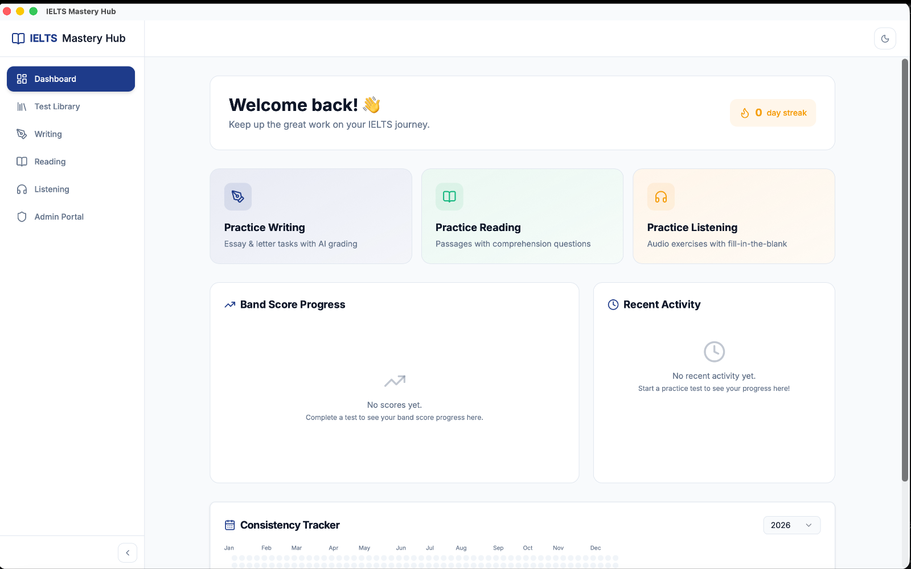

# Welcome to IELTS Mastery Hub

IELTS Mastery Hub is a desktop app that helps you practice the three main IELTS skills in one place: **Writing**, **Reading**, and **Listening**. It also gives you a **Dashboard** to track your progress and a **Test Library** where you can browse practice tests.

If you manage content for other learners, the same app also includes an **Admin Portal**.

## What you can do in the app

- **Practice Writing** and get AI-graded feedback
- **Practice Reading** with timed passages and questions
- **Practice Listening** with audio-based tasks
- **Open the Test Library** to find practice tests
- **Use the Dashboard** to see your streak, scores, and recent study activity

## No account needed

You do not need to sign up or log in before using the app. IELTS Mastery Hub saves your progress **locally on this computer**.

:::note Saved on this device
Your study history, scores, and progress stay on this device. That is the normal way the app works today.
:::

## Your first screen: the Dashboard

When you open the app, you land on the **Dashboard**. This is your home screen. From here, you can:

- see your current study streak
- jump straight into Writing, Reading, or Listening
- check your recent activity
- look at your band score progress over time

## A quick tour of the sidebar

The main sidebar appears in this order:

| Sidebar item | What it is for |
|---|---|
| **Dashboard** | Your main home screen and progress overview |
| **Test Library** | Where you browse available practice tests |
| **Writing** | Opens the Writing practice area |
| **Reading** | Opens the Reading practice area |
| **Listening** | Opens the Listening practice area |
| **Admin Portal** | Tools for creating and managing test content |

## Moving around the app

Using the app is simple:

1. Open IELTS Mastery Hub.
2. Start on the **Dashboard**.
3. Click any item in the left sidebar to move to that section.
4. Return to the Dashboard any time to check your progress.

:::tip Offline use
Everything in the app works offline **except Writing AI grading**. Writing feedback needs an internet connection because it uses an external grading service.
:::

## For admins

If you are an admin or teacher, you can open the **Admin Portal** from the same sidebar. There is currently **no separate admin login**, so student and admin areas are all available from the same app window.
