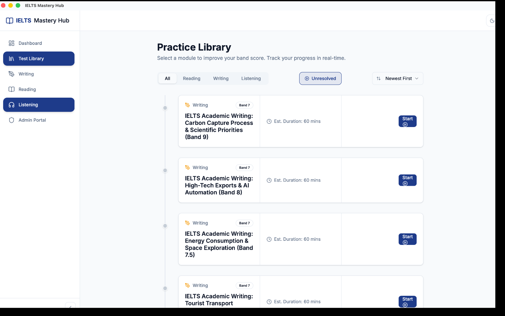

# Finding and Starting a Practice Test

The Practice Library is the main place to choose what you want to work on next. You can browse all available tests, narrow the list by module, and jump back into unfinished work.

## What you'll see on this screen

| Area | What it does |
| --- | --- |
| **All / Reading / Writing / Listening** tabs | Show all tests together, or only one module at a time. |
| **Unresolved** filter | Hides completed tests so you can focus on tests you have not finished yet. |
| **Newest First** sort | Changes the order of the test cards. |
| **Test cards** | Show the test title, module, band level, estimated duration, and your current status. |

## What each test card means

| Status | What it means | What to click |
| --- | --- | --- |
| **Not Started** | You have not opened this test yet. | **Start** |
| **In Progress** | You already began this test and your progress was saved. | **Continue** to resume where you left off |
| **Completed** | You already finished this test. Your band score is shown on the card. | **Review** to look back at your result |

:::tip
If you want to focus on unfinished work, turn on **Unresolved**. This is especially useful when your library starts to fill up.
:::

## How to start a test

1. Open **Test Library** from the left sidebar.
2. Choose a tab: **All**, **Reading**, **Writing**, or **Listening**.
3. If needed, turn on **Unresolved** or change the sort order.
4. Click **Start** on the test you want.
5. The app opens the correct practice screen for that module.
6. On the start screen, click **Start Now** to begin the timed test.

## How resuming works

If a test is already in progress, the card changes from **Start** to **Continue**.

When you open it again:

- your saved session is loaded
- your previous answers come back
- the test timer continues from where that session left off

This means you do not need to restart just because you closed the app or left the test screen.

## Starting a new attempt after finishing

After a completed test, the card shows **Review** instead of **Start**. If you want a fresh attempt, open the completed test and use the retry option inside that module's result screen.

## Good to know

:::note
You can only work on one active test at a time. If another test is already in progress, the app asks you to go back and finish or resume that test first.
:::
