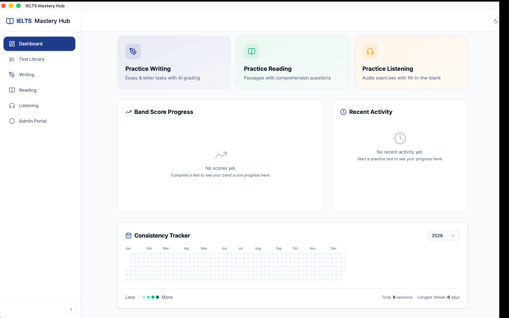

# Understanding Your Dashboard

The Dashboard is the first screen you see when you open IELTS Mastery Hub. It gives you a quick picture of how your study is going, what you did recently, and where to go next.

## What you will see

Your Dashboard is made up of a few simple sections:

| Section | What it shows |
|---|---|
| **Welcome back!** | Your home screen header |
| **Day streak** | How many days in a row you have been active |
| **Quick Action cards** | Fast links to Writing, Reading, and Listening |
| **Band Score Progress** | A chart of completed scores over time |
| **Recent Activity** | Your latest practice sessions |
| **Consistency Tracker** | A calendar-style view of your study activity |

## The header and streak

At the top, you will see the **Welcome back!** message and your **day streak**.

Your streak is there to help you notice study consistency at a glance. If you have not studied recently, it may show **0 day streak**.

## Quick Action cards

Just below the header, you will see three cards:

- **Practice Writing**
- **Practice Reading**
- **Practice Listening**

These are simple shortcuts. Click one to open that practice area right away.

## Band Score Progress

The **Band Score Progress** panel shows your completed scores over time.

- It uses your finished Reading, Listening, and Writing results
- Different modules can appear as separate lines
- It helps you spot trends instead of looking at one score by itself

If you are new to the app, this panel shows the empty message **"No scores yet."**

## Recent Activity

The **Recent Activity** panel shows your latest practice sessions.

You may see:

- an **In Progress** session with a progress amount
- a **Completed** session with a band score
- an attempt label such as **Attempt 2** if you retook the same test

Clicking a Recent Activity item opens that practice module again. If the session is still in progress, you can continue from where you left off.

If you have not started anything yet, this panel shows **"No recent activity yet."**

## Consistency Tracker

The **Consistency Tracker** is a heatmap-style calendar of your study activity.

- each small square represents a day
- more activity makes a day look stronger on the chart
- you can use it to see how steady your routine has been over time

It also helps you notice quiet weeks so you can get back into a rhythm.

:::tip New to the app?
It is completely normal for the Dashboard to look mostly empty at first. Once you finish a few practice sessions, the chart, activity list, and tracker start filling in automatically.
:::

## A simple way to use the Dashboard

1. Open the app and land on the Dashboard.
2. Check your streak and latest progress.
3. Use a Quick Action card to start practicing.
4. Come back later to see your new score and updated activity.
